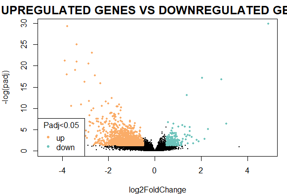
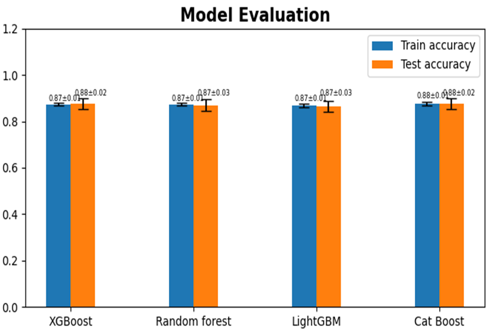
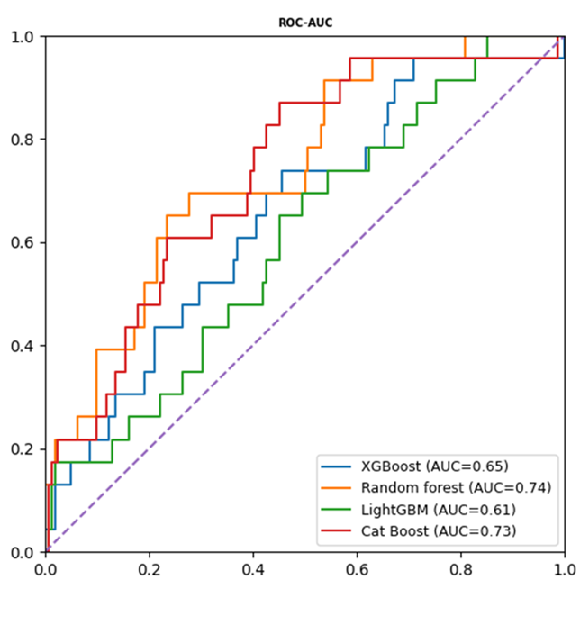
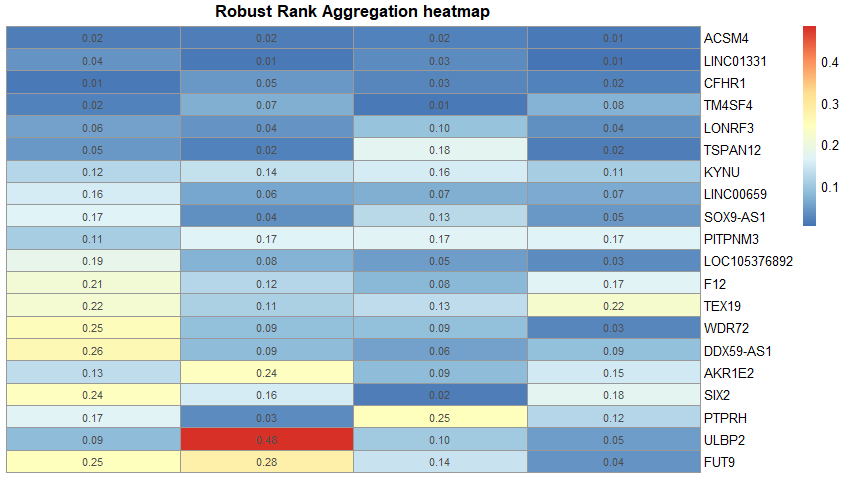

# 1.Introduction
This personal project is conducted to identify potential gene biomarkers for Breast Cancer (BRCA) using the TCGA-BRCA dataset. The main objective is to develop a computational pipeline where multiple Machine Learning (ML) models are combined to find the most significant genes for distinguishing between cancer and normal samples.

In this project, an ensemble-based feature selection strategy is implemented. Four powerful models, including Random Forest, XGBoost, CatBoost, and LightGBM, are utilized to rank genes based on their feature importance. Since features are ranked differently by each model, the Robust Rank Aggregation (RRA) method is applied to integrate these individual lists into a single "consensus" ranking. By using this approach, the bias of any single algorithm is minimized, and the selected biomarkers are ensured to be consistently significant across all models.

# 2.Method
## 1.1. Data Pre-processing and Differential expression analysis
The TCGA-BRCA dataset is utilized as the primary data source. After initial cleaning and normalization, Differential Expression Analysis is performed to compare cancer and normal samples. To select potential features, a threshold of $|\log_2FC| > 0.5$ and $P < 0.05$ is applied. Only genes meeting these criteria are kept for the next steps.
## 1.2. Embedded Feature Selection
Four ensemble-based Machine Learning models are employed to identify the most predictive genes: Random Forest, XGBoost, CatBoost, and LightGBM. These models are trained on the pre-selected genes to perform classification. Embedded Feature Importance is then calculated by each algorithm, and genes are ranked based on their contribution to the model's performance.
## 1.3. Robust Rank Aggregation
The individual ranking lists from the four ML models are integrated using the Robust Rank Aggregation (RRA) method. This statistical step is applied to identify a "consensus" list of genes. A final $P$-value is assigned to each gene, and only those that are consistently ranked at the top across all algorithms are selected as candidate biomarkers.
## 1.4. Oncology Enrichment Analysis
To explore the biological significance of the identified biomarkers, Enrichment Analysis is conducted. Specifically, Gene Ontology (GO) terms are analyzed to determine the biological processes and molecular functions associated with these genes. This step is performed to ensure the selected biomarkers are relevant to cancer biology.

# 3.Results:
## 3.1. Differential Expression Analysis (DEA)

In the first stage of this project, Differential Expression Analysis (DEA) was conducted on the TCGA-BRCA dataset to identify genes with significant expression changes between cancer and normal samples. Based on the statistical threshold of |log₂FC| > 0.5 and P < 0.05, a total of 1,340 differentially expressed genes (DEGs) were identified. Within this set, 456 genes were found to be up-regulated, while 886 genes were classified as down-regulated. The distribution and significance of these candidates are clearly illustrated in the Volcano plot, where specific focus was placed on the up-regulated genes due to their potential roles in diagnosis and treatment.

  
   
  <i>
    Figure 1: Volcano plot representing 1,340 differentially expressed genes, including 456 up-regulated and 886 down-regulated candidates.
  </i>

Following the identification of these DEGs, the 456 up-regulated genes are selected as the primary input features for the next stage, which is Machine Learning training. These features will be used to train multiple models to evaluate and rank their importance.

## 3.2. Machine Learning Training and Evaluation

In this stage, the 456 up-regulated genes identified from the DEA step were utilized to train four ensemble-based models: `XGBoost, Random Forest, LightGBM, and CatBoost`. To achieve the highest predictive performance, `Bayesian Optimization` was employed for hyperparameter tuning, allowing for an efficient search of the optimal model configurations.

The performance of the trained models was evaluated using Accuracy and ROC-AUC metrics. As illustrated in the figures below, all models demonstrated stable performance with Test Accuracy ranging from `0.87 to 0.88`. Specifically:
- XGBoost: Test Accuracy of `0.88 ± 0.02` and an AUC of `0.65`.
- Random Forest showed a Test Accuracy of `0.87 ± 0.03` and the highest AUC of `0.74`
- LightGBM reached a Test Accuracy of `0.87 ± 0.03` and an AUC of `0.61`.
- CatBoost demonstrated a Test Accuracy of `0.88 ± 0.02` and a high AUC of `0.73`.

  
   
  <i>Figure 2: Model Evaluation metrics showing Train and Test Accuracy for the four algorithms.</i>

  
   
  <i>Figure 3: ROC-AUC curves illustrating the diagnostic performance of the optimized models.</i>

The extraction of feature importance from these optimized models serves as the critical input for the subsequent <b>Robust Rank Aggregation (RRA)</b> stage to identify the final consensus biomarkers.

## 3.3. Robust Rank Aggregation (RRA)

To identify a consensus set of biomarkers, the individual feature importance rankings from the four optimized machine learning models were integrated using the Robust Rank Aggregation (RRA) method. This statistical approach was applied to minimize the inherent biases of specific algorithms and to prioritize genes that were consistently ranked as highly significant across all models. By aggregating these multiple ranking lists, a stable and high-confidence signature of up-regulated genes was established.

  
   
  <i>
    Figure 4: Robust Rank Aggregation heatmap displaying the top-ranked consensus biomarkers across the four models.
  </i>

The aggregation process successfully identified several key genes with high stability scores, as visualized in the RRA heatmap. Top-ranked candidates, including `ACSM4, LINC01331, CFHR1, and TM4SF4`, exhibited consistently low p-values across the ensemble, suggesting their strong potential as robust biomarkers for breast cancer. These consolidated results confirm that the integration of multiple machine learning architectures provides a more reliable selection than any single model alone.

## 3.2. Oncology Enrichment Analysis (GO)

Immediately following the differential expression analysis, an <b>Oncology Enrichment Analysis (GO)</b> was performed as a functional branch study to investigate the biological significance of the identified candidates. This analysis was conducted on both <b>456 up-regulated</b> and <b>886 down-regulated genes</b> to categorize them into functional groups, providing a deeper understanding of the molecular mechanisms driving breast cancer progression.

As illustrated in the bubble plots below, the identified DEGs are enriched in distinct biological pathways. For the <b>886 down-regulated genes</b>, the enrichment is predominantly found in processes related to tissue structure and cell communication, such as <i>epidermis development</i>, <i>skin development</i>, and <i>cell-cell adhesion via plasma-membrane adhesion molecules</i>. Additionally, significant activity is observed in <i>neuropeptide signaling pathways</i> and <i>hormone metabolic processes</i>.

  
   
  <i>
    Figure 2: GO enrichment analysis for down-regulated genes displaying functional categories in epidermis development and cell adhesion.
  </i>

However, specific focus is placed on the <b>456 up-regulated genes</b>, as they demonstrate highly significant enrichment in critical <b>Biological Processes (BP)</b> and <b>Cellular Components (CC)</b> related to RNA metabolism and spliceosomal machinery. Significant enrichment is observed in processes such as <i>spliceosomal tri-snRNP complex assembly</i> and <i>spliceosomal snRNP assembly</i>. Furthermore, a high concentration of these genes is identified within the <i>small nuclear ribonucleoprotein complex</i> and the <i>Sm-like protein family complex</i>. 

  
   
  <i>
    Figure 3: GO enrichment analysis for up-regulated genes highlighting RNA processing and spliceosomal complexes.
  </i>

These findings suggest that the dysregulation of the spliceosome machinery plays a vital role in the cellular pathology of the breast cancer samples. The functional insights gained from this analysis reinforce the biological relevance of the up-regulated features, confirming their suitability for the subsequent <b>Machine Learning training</b> stage to evaluate their predictive importance.
